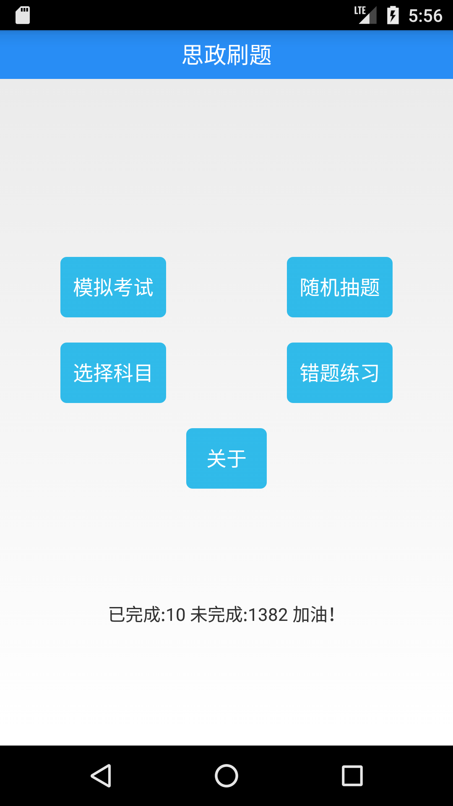
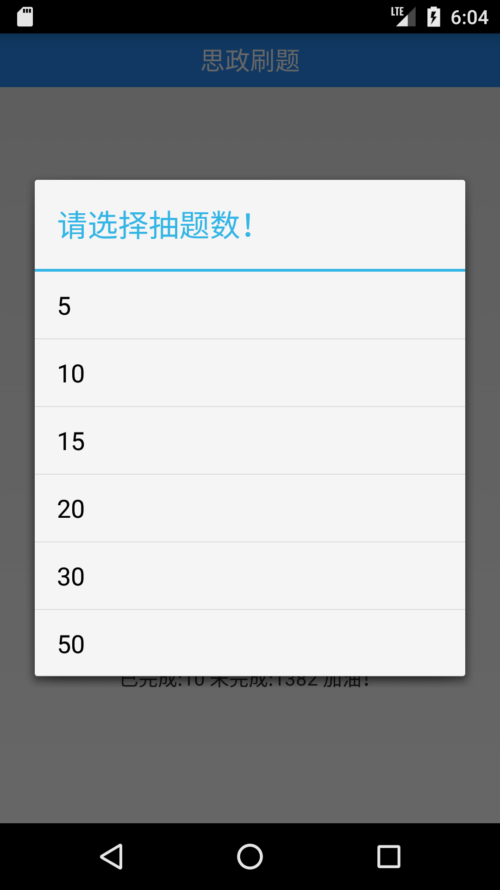
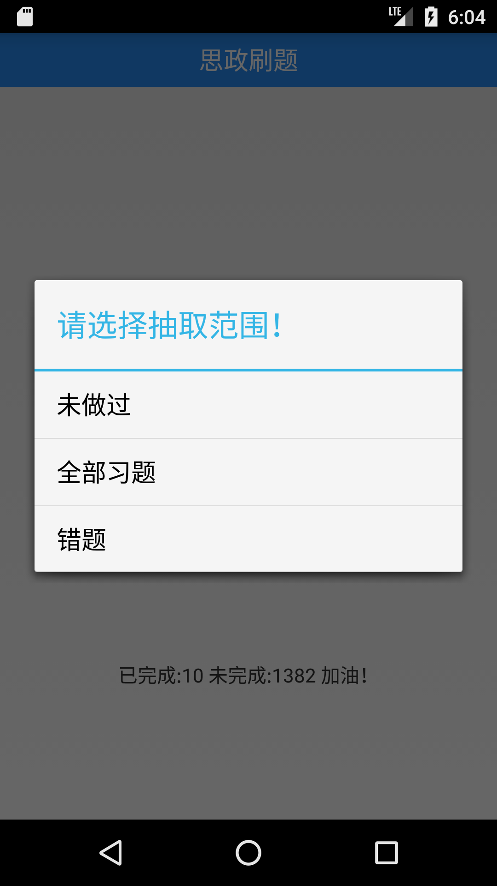
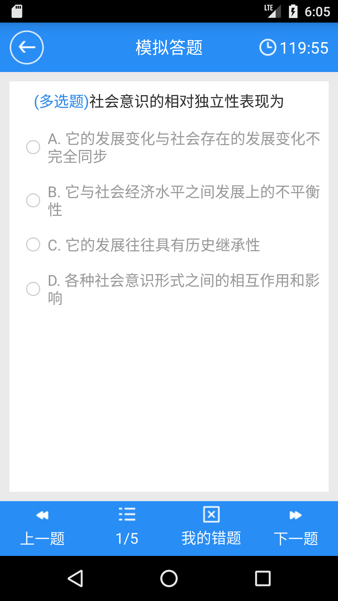

# 思政刷题app

内置南京林业大学19版题库

支持单选，多选，判断

Fork from https://github.com/code-hunter/Answer

欢迎有能力的学弟学妹继续维护！

[直接下载最新版](Answer-master-release.apk)

## 增加功能
1. 数据库多表切换功能(适应切换马原，毛概，思修等)
2. 随机抽题(分为未做过，全部习题，错题)
3. 错题记录累加(即做错n次后需做对n次才能从错题记录中消除)
4. 蒙对标为错题功能
5. 首页已做题目数统计

------

## 截图：

